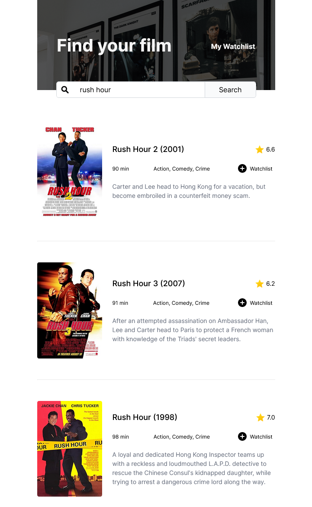
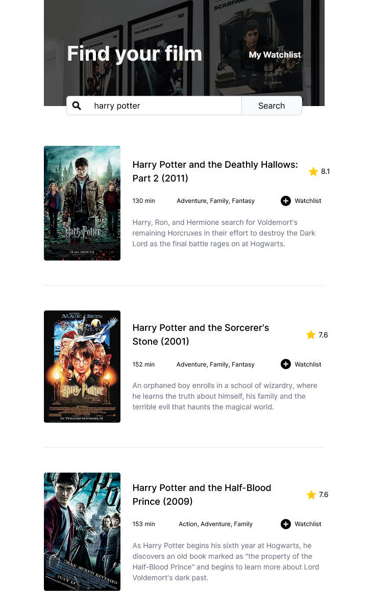

# Movie Watchlist App

A simple movie watchlist application that allows users to search for movies and display relevant information. This project is built using plain JavaScript and uses OMDB API.

## Features

- **Search Movies**: Utilizes the OMDB API to search for movies based on user input.
- **Display Movie Information**: Shows relevant details such as title, year, genre, and poster for each searched movie.

## Demo

<p align="center">
  
</p>

**data.js**
```javascript
const api = {
  dataRequestUrl: "https://www.omdbapi.com/?apikey=",
  posterRequestUrl: "https://img.omdbapi.com/?apikey=",
  key: "your_api_key",
};

export { api };
```

# Screenshots
<p align="center">
  
  
  
</p>
